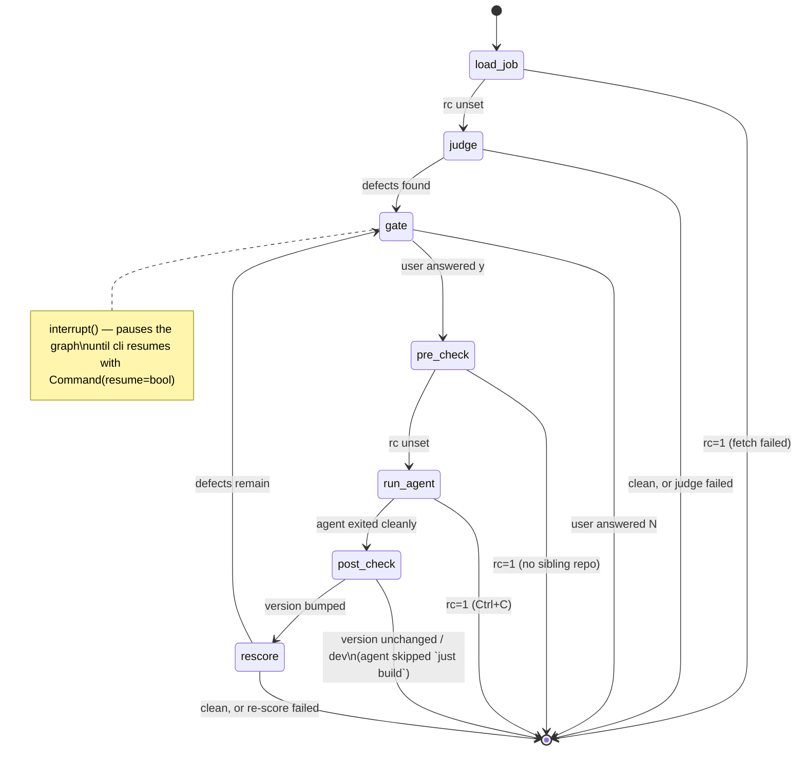

# linkedin-jobs-critics

A langchain critic that checks whether the [`linkedin-jobs`](https://github.com/paputechxyz/linkedin-job-cli) Go CLI parsed a single job's fields correctly, by comparing stored parsed values against the job's full description. It writes an improvement-plan markdown of findings and — optionally — runs a human-gated judge→fix→re-judge loop that spawns an opencode coding agent in the sibling CLI repo to apply the fixes.

## What it does

Given a LinkedIn **job id**, critics:

1. **Looks it up** in the local DB via `linkedin-jobs show <id> --json`.
2. **Fetches if missing** — if the job isn't stored, critics runs `linkedin-jobs score-job <id>` to fetch + score it first, then reads it back.
3. **Critics judge** compares each parsed field (`salary`, `location`, `remote_type`, `title`, `company`) against the full description — the ground truth — using an LLM with provider-enforced structured output.
4. **Improvement-plan MD** lists each defect with the stored value, a verbatim quote from the description as evidence, and the source location to fix. If nothing is wrong, it says so and exits.
5. **Agent loop (optional)** — if defects are found, prompts `Proceed to spawn opencode agent? [y/N]`. On yes, hands the defects to an interactive [opencode](https://opencode.ai) session in the sibling `linkedin-job-cli` repo. When you exit opencode, critics re-scores + re-judges; clean ends the loop, still-defective writes a fresh plan and re-prompts. Each round carries prior-round history so the agent doesn't repeat dead ends.

## How the judge works

The judge (`src/critics/judge.py`, `judge_job`) is a single tool-less LLM call that asks one question: *for each parsed field, does the stored value agree with the job's full description (the ground truth)?*

### Inputs

The job dict from the local DB is flattened into one user message (`_job_payload`):

- the five parsed fields under review — `salary`, `location`, `remote_type`, `title`, `company` (their current stored values, with salary rendered from `salary_raw` / `salary_low`–`salary_high` + currency)
- the full LinkedIn `description`, pasted verbatim as the ground truth

### Structured output, provider-enforced

The LLM is bound to a Pydantic schema via `ChatOpenAI.with_structured_output(CritiqueReport, method="json_mode")`, so the provider is forced to return JSON matching the schema rather than free-form text that critics then has to parse:

```python
class Finding(BaseModel):
    field: str                    # salary | location | remote_type | title | company
    stored_value: str             # the value currently in the DB
    evidence_quote: str           # verbatim quote from the description
    is_consistent: bool           # True = stored value agrees with the description
    suggested_fix: str | None     # when inconsistent, the source location to fix

class CritiqueReport(BaseModel):
    job_id: str
    title: str
    findings: list[Finding]       # one entry per parsed field
```

If the provider rejects `json_mode` or returns malformed JSON (`OutputParserException` / `ValidationError` / `ValueError`), critics falls back to a second invocation that appends a "respond with ONLY a JSON object" instruction, then regex-extracts the first `{...}` block (handling both ```json fenced and bare JSON) and validates it against the same schema. This keeps the judge working against endpoints (e.g. some z.ai / glm-5.2 deployments) that don't honor structured-output modes.

### What the system prompt asks for

The system prompt (`JUDGE_SYSTEM`) instructs the model to:

- assess **every one of** salary, location, remote_type, title, company — no field skipped
- quote the description **verbatim** as evidence (so a human can verify the call)
- when inconsistent, name **where the value should be sourced/fixed** — e.g. "salary often comes from the page's rounded card band while the real base salary is in the description body"
- be **lenient on `title` and `company`**: treat them as consistent when the difference is purely cosmetic — typo, misspelling, case, punctuation, trailing legal suffix (`Inc.`, `LLC`, `Ltd.`), or minor abbreviation/expansion (`Sr.` vs `Senior`). Only flag a substantive mismatch (genuinely different role level/duty, or a different organization).
- be **lenient on `salary` when the description is silent on pay**: mark it consistent — the stored salary is sourced from LinkedIn's salary card (a separate employer-provided structured field), not the description body, so the body's silence is not a defect. Only flag salary when the body explicitly states a pay figure that materially contradicts the stored value. This kills the false-positive class where a card-sourced salary had no body corroboration.

### Header-tag cross-check (non-LLM, layered on after)

After the LLM judge returns, critics runs a deterministic check (`header_tag_finding`) against LinkedIn's Voyager `jobPostings` API via `linkedin-jobs header-tags <id>`. The API returns the authoritative `workplaceTypes` badge (On-site / Hybrid / Remote). If the stored `remote_type` disagrees with that badge — and only then — an extra `remote_type (header tag)` Finding is appended to the report, pointing the fix at `internal/linkedin/scraper.go` (`DetectRemote` heuristic + the API-fallback guard). The check is conservative: no Finding is added when the API soft-missed (no `voyager_api` source), returned no workplace signal, or the stored value already matches.

### What you get back

A `CritiqueReport` with one `Finding` per field. The improvement-plan MD lists only the inconsistent ones (`report.py:write_report`), each with stored value, evidence quote, and suggested fix; consistent fields are counted in the summary line. The graph then routes on whether *any* finding has `is_consistent=False`.

## The judge→fix→re-judge graph

The loop is a LangGraph state machine (`src/critics/graph.py`). Seven nodes, wired so that any node can short-circuit to `END` by setting `rc`; otherwise control flows to the next node. `rescore` loops back to `gate`, which is the actual fix→re-judge cycle.



| Node | Job |
|---|---|
| `load_job` | `linkedin-jobs show <id> --json`; falls back to `score-job` if missing |
| `judge` | runs `judge_job` (above) + header-tag cross-check, writes the plan MD |
| `gate` | `interrupt()` — pauses for the user's `[y/N]`; `cli.py` resumes with `Command(resume=...)` |
| `pre_check` | resolves the sibling repo, builds the handoff prompt (with prior-round history), records `linkedin-jobs version` before |
| `run_agent` | spawns the interactive opencode TUI in `../linkedin-job-cli`; captures the session id for the next round |
| `post_check` | re-reads `linkedin-jobs version`; rejects the round if unchanged or still `dev` |
| `rescore` | `score-job` to re-fetch, then `judge_job` again on every field (so regressions surface); loops back to `gate` if defects remain |

The conditional edges all use the same helper (`_route_by_rc`): if `rc` is set in state, go to `END`; otherwise continue. The checkpointer is an in-memory `MemorySaver` (required for `interrupt()`), with a whitelisted serde so the `CritiqueReport` round-trips cleanly.

## Install

Requires Python 3.11+ and [uv](https://docs.astral.sh/uv/) (or pip).

```bash
uv sync            # or: python -m venv .venv && .venv/bin/pip install -e ".[dev]"
```

For LangSmith tracing (optional), install the extra:

```bash
uv sync --extra tracing   # or: pip install -e ".[tracing]"
```

Build the Go CLI and put it on your `PATH` (or set `LJ_BIN_PATH`):

```bash
( cd ../linkedin-job-cli && go build -o linkedin-jobs . )
export PATH="$PWD/../linkedin-job-cli:$PATH"
```

Configure an OpenAI-compatible LLM provider once (shared with the Go CLI):

```bash
linkedin-jobs config llm        # or: export OPENAI_API_KEY=sk-...
```

### For the agent loop (optional)

The loop hands parser defects to a coding agent in the sibling repo. It needs three extra things:

- **[opencode](https://opencode.ai)** on your `PATH` — the coding agent TUI.
- **[just](https://github.com/casey/just)** on your `PATH` — the sibling repo's `justfile` has a `just build` recipe that bumps the patch version when Go source changes. critics checks `linkedin-jobs version` before and after each agent round and rejects the round if it's unchanged or `dev`, so the agent MUST rebuild via `just build` (not plain `go build`, which leaves the version at `dev`).
- **The sibling repo** at `../linkedin-job-cli` (relative to where you run critics), or set `LJ_CLI_DIR`.

## Run

```bash
uv run critics 4259504707 -o improvement-plan.md
```

Pass one or more job ids, comma-separated; each runs its own judge→fix→re-judge
loop in turn:

```bash
uv run critics 4259504707,4259504708,4259504709 -o improvement-plan.md
```

If a job is already in the DB it is judged immediately; otherwise critics runs
`linkedin-jobs score-job <id>` to fetch + score it first, then judges it.

If the plan lists defects and you answer `y` at the prompt, an opencode TUI opens
in `../linkedin-job-cli` with the defects pre-loaded. Supervise the agent, then
**exit opencode with `/exit`** (or `/q`, or `Ctrl+x` then `q`) — do **not**
Ctrl+C, that kills critics too. On exit, critics:

1. Checks `linkedin-jobs version` is newer than before the round (and not `dev`) —
   if not, the agent skipped `just build`; critics stops without re-scoring.
2. Re-scores the job and re-judges it (all fields, so regressions surface).
3. Reports success if clean, or writes a fresh improvement plan and re-prompts.

critics never commits — you commit manually in `linkedin-job-cli`.

## Config

| Variable | Purpose | Default |
|---|---|---|
| `LJ_BIN_PATH` | path to the `linkedin-jobs` binary | `linkedin-jobs` on `PATH` |
| `LJ_CONFIG_DIR` | dir for the Go CLI's `config.json` | `~/.linkedin-jobs` |
| `LJ_CLI_DIR` | path to the sibling `linkedin-job-cli` repo (for the agent loop) | `../linkedin-job-cli` |
| `OPENAI_API_KEY` / `LJ_LLM_API_KEY` | LLM key (env fallback) | — |
| `OPENAI_BASE_URL` / `LJ_LLM_BASE_URL` | OpenAI-compatible base URL | `https://api.openai.com/v1` |
| `LJ_LLM_MODEL` | model name | `gpt-4o-mini` |

The provider config is reused from the Go CLI's `~/.linkedin-jobs/config.json` — one key store.

## Tracing with LangSmith

Critics lights up [LangSmith](https://smith.langchain.com) tracing automatically
as soon as a LangSmith API key is in the environment — no code changes needed.
Every LLM call, the LangGraph step transitions, and the `judge_job` span land
in your project so you can inspect prompts, responses, token usage, and errors.

```bash
export LANGSMITH_API_KEY=lsv2_sk_...
uv run critics 4259504707 -o improvement-plan.md
# -> "Tracing enabled (LangSmith project: linkedin-jobs-critics)."
```

Runs the trace to the `linkedin-jobs-critics` project by default. Override with
`LANGSMITH_PROJECT`. No key? Critics runs normally, just untraced.

| Variable | Purpose | Default |
|---|---|---|
| `LANGSMITH_API_KEY` (or `LANGCHAIN_API_KEY`) | LangSmith API key; enables tracing when set | unset = tracing off |
| `LANGSMITH_PROJECT` (or `LANGCHAIN_PROJECT`) | project name runs are logged under | `linkedin-jobs-critics` |
| `LANGSMITH_TRACING` | force tracing on/off | `true` once a key is present |

To view traces, open the project at
`https://smith.langchain.com/<your-org>/projects/p/<project>`.

## Test

```bash
pytest
```
